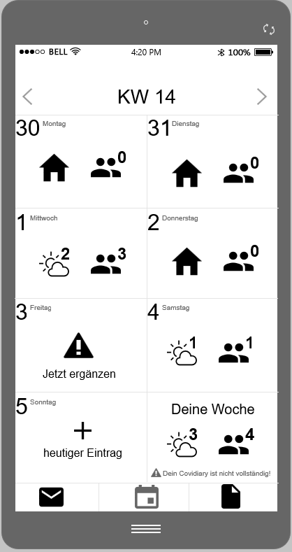
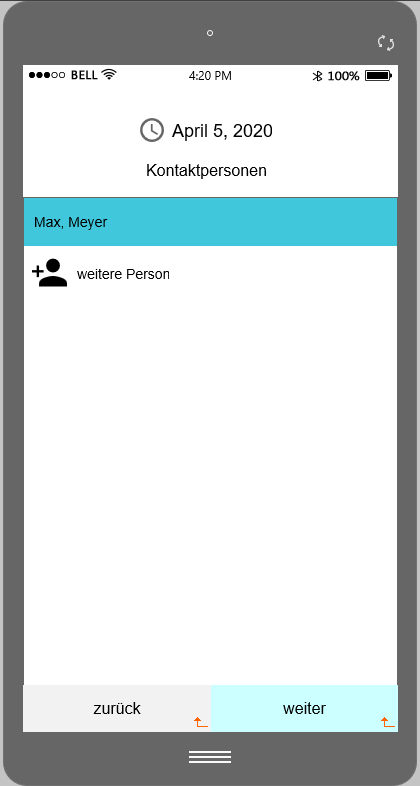

# [Covidiary](https://covidiary.netlify.com/)

## Submission

This is the submission to Devpost.

### Inspiration

### What it does

Covidiary unterstützt einen dabei, den täglichen Ablauf nachvollziehen zu können. Abends trägt man ganz bequem ein, ob man draußen war, wo man war und mit wem man Kontakt hatte. Alle Daten werden dabei ausschließlich lokal gespeichert. Im Notfall kann man so sehr leicht die Infektionskette nachvollziehen und weitere potentielle Glieder ausfindig machen.

Darüber hinaus wird für jede Woche ein eigener Score errechnet, der mit dem globalen Score aller Nutzer verglichen werden kann. Auf Basis dieses Scores kann man sich mit anderen vergleichen und es können gezielt Hinwese zum Verhalten gegeben werden.

Außerdem gibt es eine Seite, die aktuelle offizielle Nachrichten, beispielsweise der Bundesregierung oder des RKI, anzeigt und somit ein Stück weit vor Fake-News schützen soll.

### How I built it

Wir haben uns für ein Ionic Frontend entschieden, damit wir eine Progressive Web App ausliefern können, die wie eine App auf einem Smartphone "installiert" werden kann. Dadurch können wir auch Push-Benachrichtigungen geben, falls es neue offizielle Nachrichten gibt oder man den Eintrag für den aktuellen Tag vergessen hat.

### Challenges I ran into

### Accomplishments that I'm proud of

### What I learned

### What's next for Covidiary

### Built With

Angular, Ionic, Java, JavaScript, Spring Boot

## Video

## Mockups

| Startseite / Kalender | Eintrag Schritt 1 |
| --- | --- |
|  |  |

| Eintrag Schritt 2 (optional) | Eintrag Schritt 3 |
| --- | --- |
|  |  |

| Eintrag Schritt 4 (optional) | Wochen Zusammenfassung |
| --- | --- |
|  |  |

| Zeitraum Zusammenfassung | Nachrichten |
| --- | --- |
|  |  |
